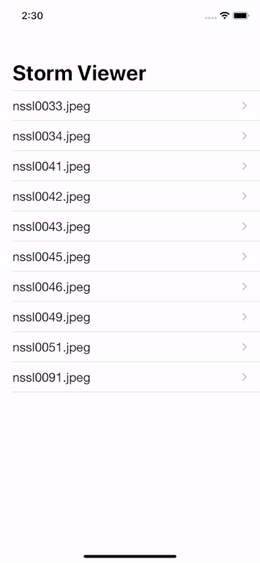

#  Project 1, 100 Day of Swift
[К оглавлению](/README.md)
      
## Описание       
В этом проекте мы познакомились с TableView, ImageView, UIImage, узнали что такое FileManager,  view controllers, storyboards, outlets, Auto Layout, а также что испробовали на практике приведением типов.

[Папка с кодом приложения](/100DayOfSwift/Project1)

## Внешний вид приложения

