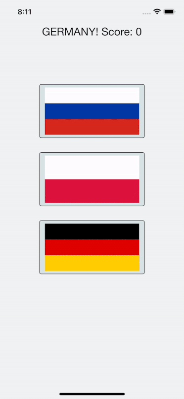

#  Project 2, 100 Day of Swift
[К оглавлению](/README.md)
      
## Описание       
В данном проекте мы изучили как добавлять файлы в Asset catalog и почему они имеют разные размеры x2 и x3. Познакомились с UIButton, CALayer, UIColor, UIAlecrtContoller и UIAlertAction. 

[Папка с кодом приложения](/100DayOfSwift/Project2)

## Внешний вид приложения

